# Operation benchmarks

This section documents the performance of Matcha operations
in comparison with other popular computing libraries,
sorted by operation type. The operations
have been tested on broad linear spaces of input scales fed into
the following input generators:

- `matrix_rect(scale)` - generates `Float[scale, max(scale / 2, 1)]` inputs
- `matrix_square(scale)` - generates `Float[scale, scale]` inputs
- `vector(scale)` - generates `Float[scale]` inputs

Note that input generation was performed always before the benchmarking
itself to avoid errors caused by the potential generation overhead.

This file and all shown benchmarks have been generated automatically.

## add

#### matrix_rect
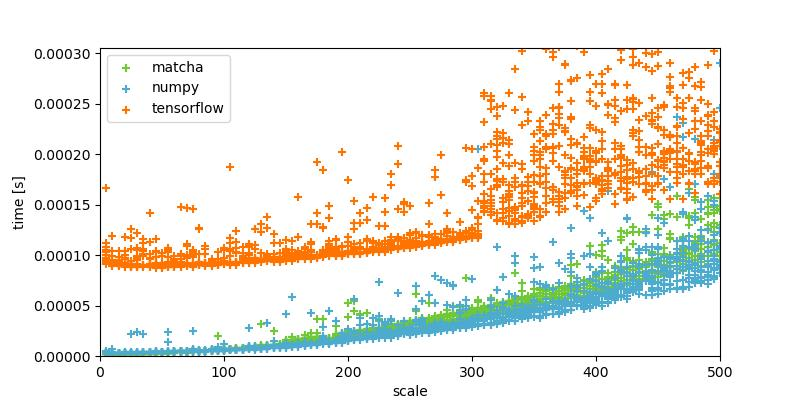
#### matrix_square
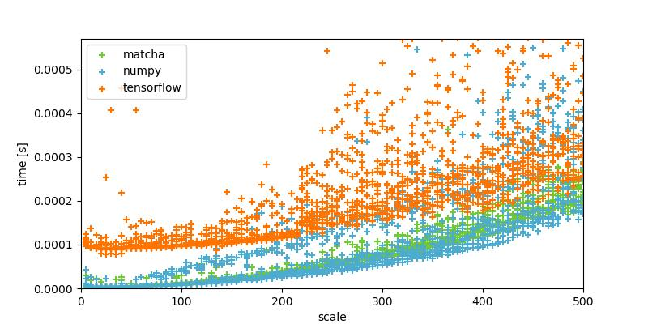
#### vector
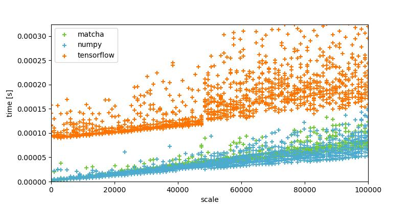

## divide

#### matrix_rect
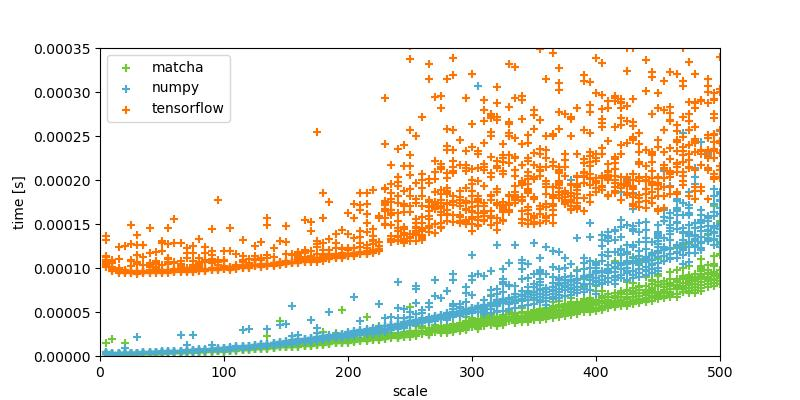
#### matrix_square
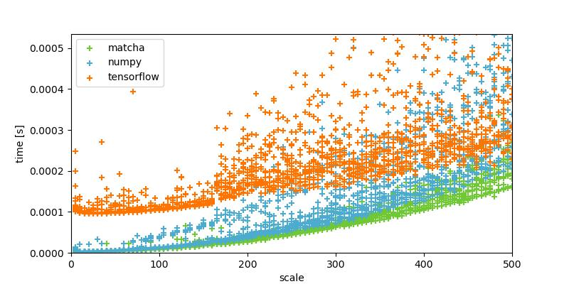
#### vector
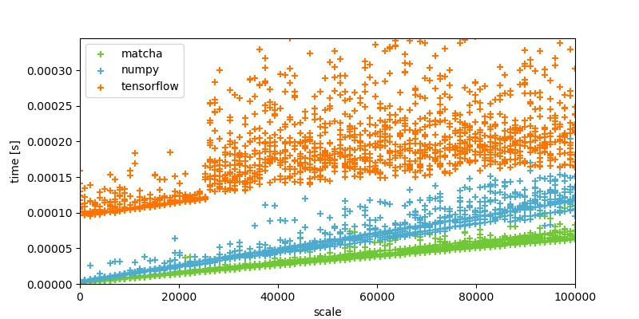

## exp

#### matrix_rect
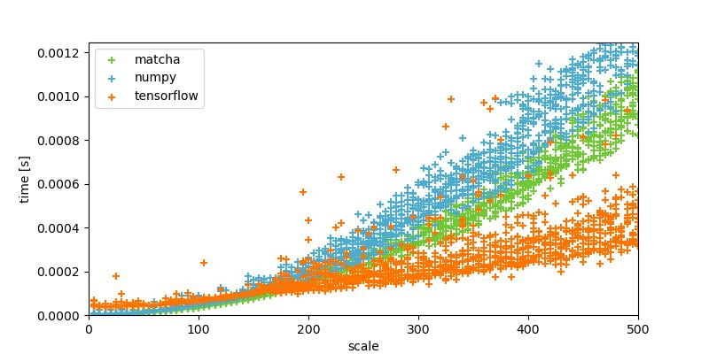
#### matrix_square
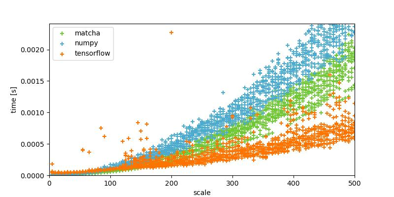
#### vector
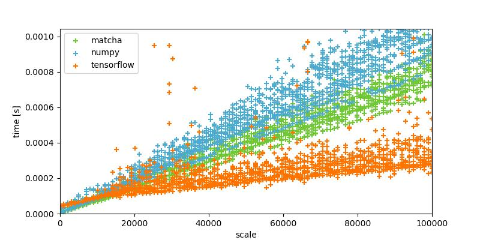

## matmul

#### matrix_square
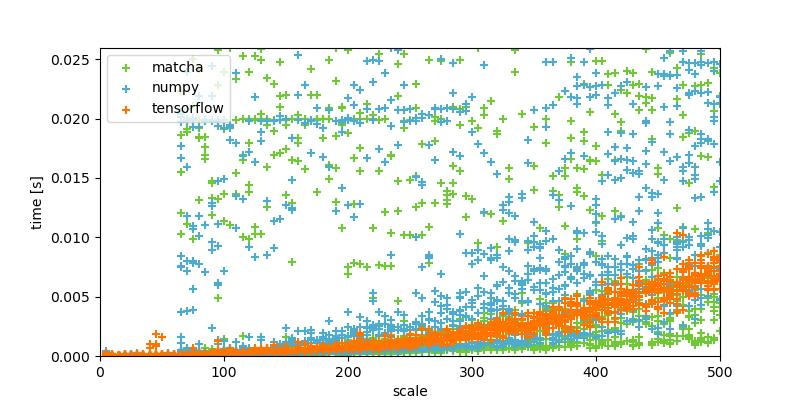

## max

#### matrix_rect
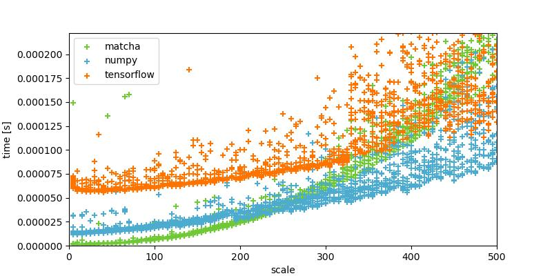
#### matrix_square
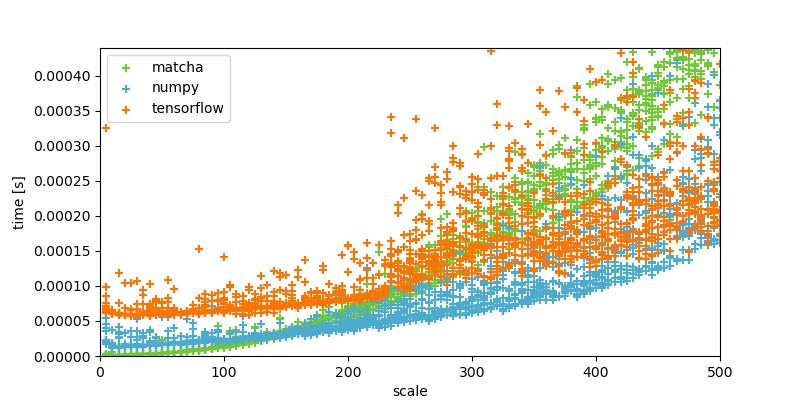
#### vector
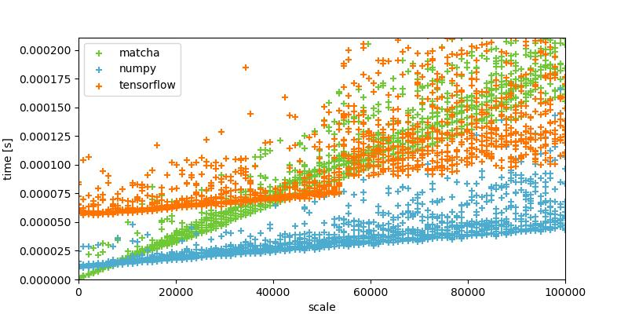

## multiply

#### matrix_rect
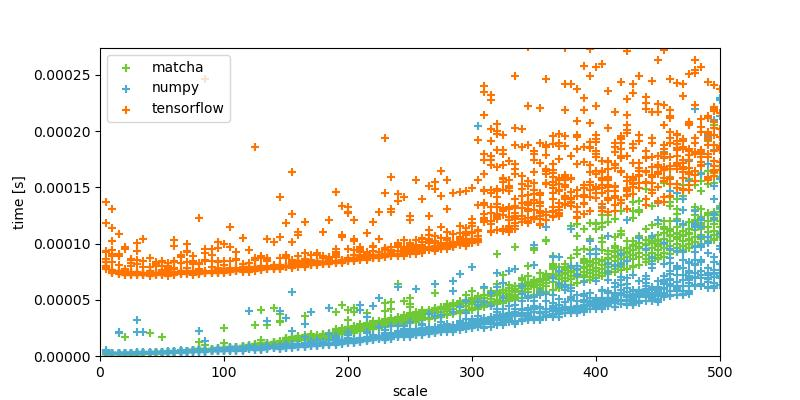
#### matrix_square
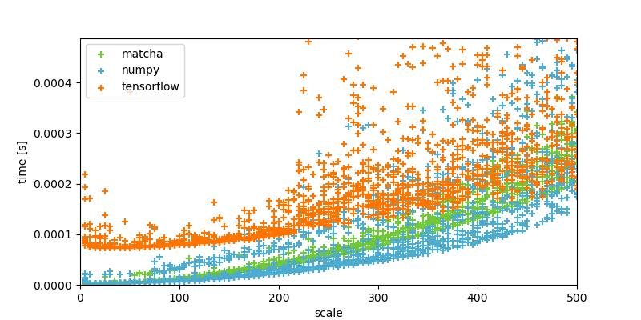
#### vector
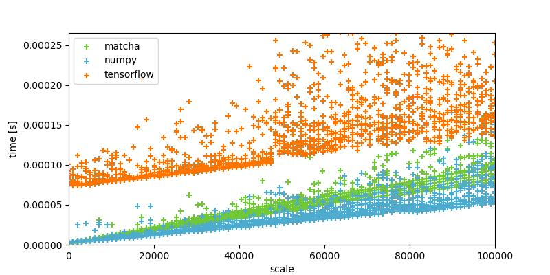

## relu

#### matrix_rect
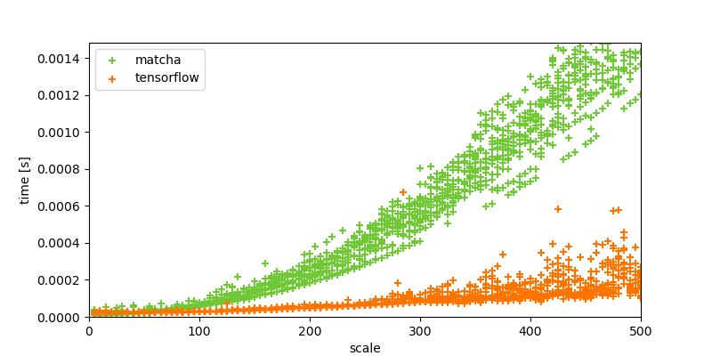
#### matrix_square
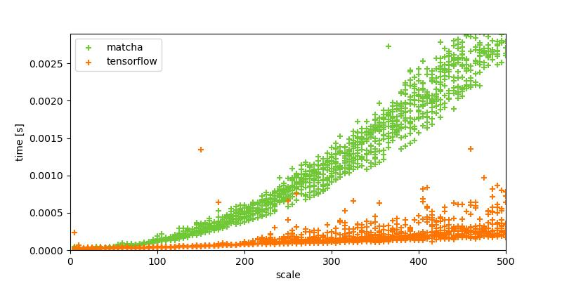
#### vector
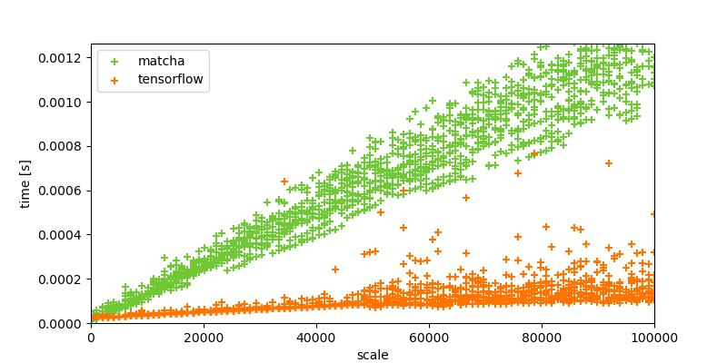

## softmax

#### matrix_rect
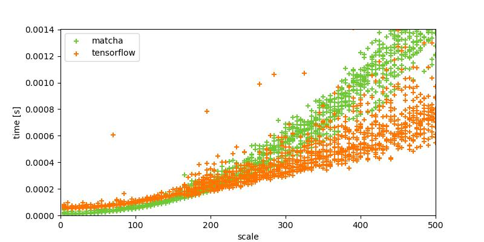
#### matrix_square
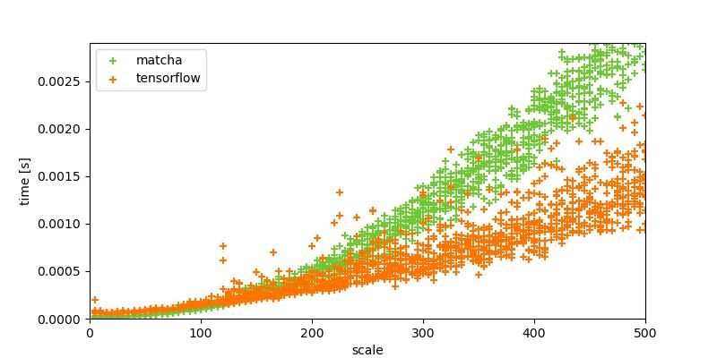
#### vector
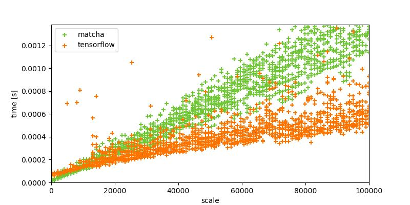

## sum

#### matrix_rect
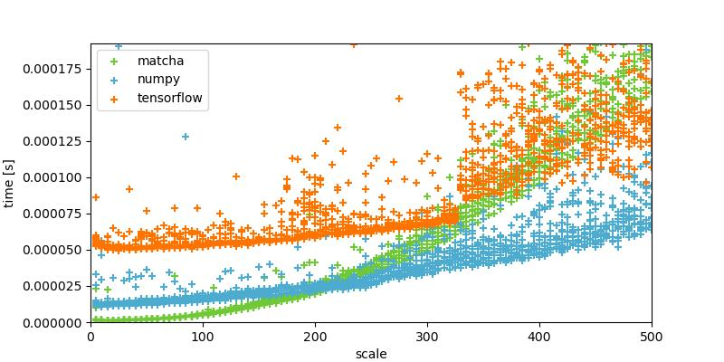
#### matrix_square
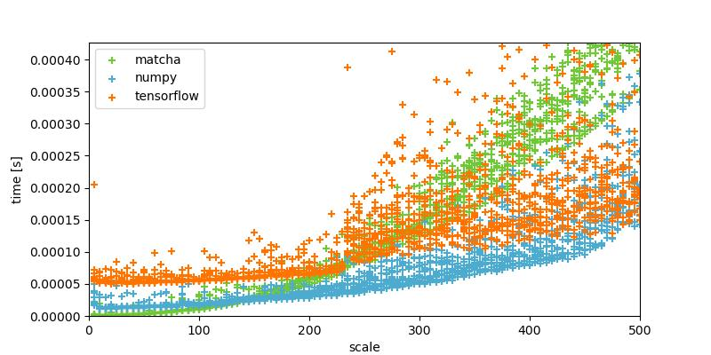
#### vector
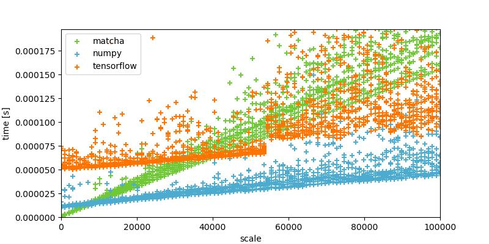

## tanh

#### matrix_rect
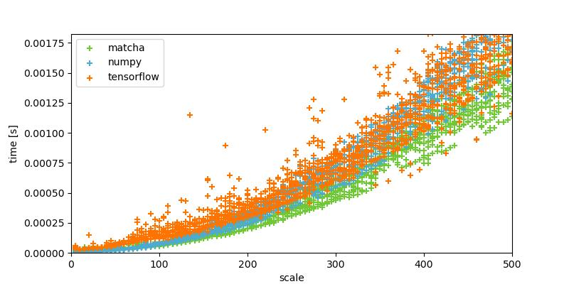
#### matrix_square
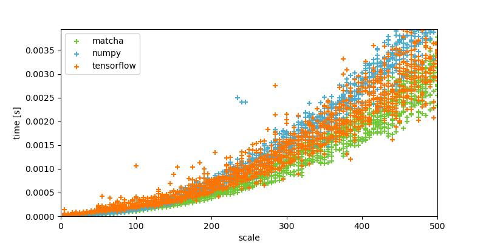
#### vector
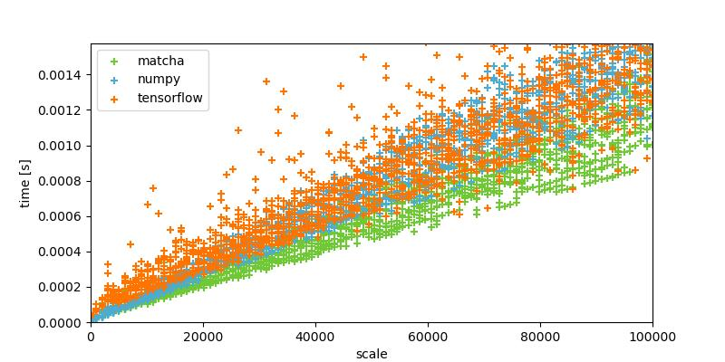

## transpose

#### matrix_rect
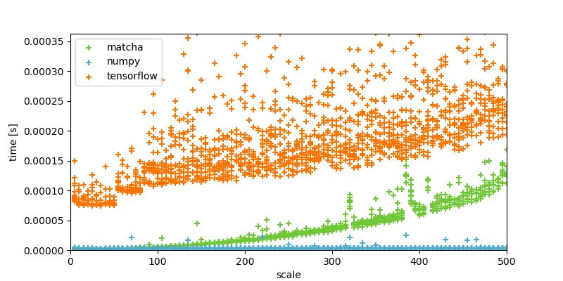
#### matrix_square
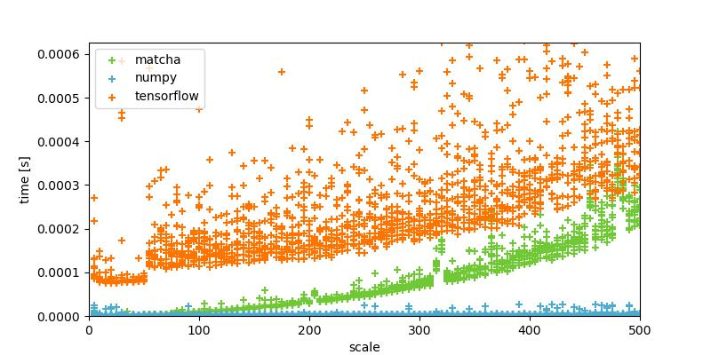

