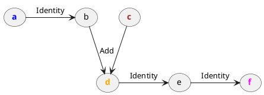
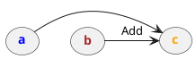

# Lambda
> `"bits_of_matcha/engine/lambda/Lambda.h"`\
> `class engine::Lambda final`

Lambda is a sequence of [`engine::Op`](engine/op/) operations stored 
for lazy execution.
It is a fundamental class within the Matcha engine, since it mediates
many core functionalities of matcha, from 
[automatic differentiation](tensor/autograd) to [JIT](tensor/jit).
Lambdas can be represented as directed acycic multigraphs, where
each [`engine::Op`](engine/op/) represents one node, 
and each [`engine::Tensor`](engine/tensor) represents one edge,
or vice versa.

A lambda has its inputs and outputs, similarly to a single 
[`engine::Op`](engine/op/).
Apart from inputs, lambda also has its constants, which are tensors needed
to produce the lambda's outputs that don't depend on any other operation
and are guaranteed not to change. Similar to them are side-inputs,
which don't depend on any operation within the lambda, but can be
modified externally.

Given all inputs, side-inputs, and constants, running a lambda
produces its outputs and side effects. For running lambdas, use
an [`engine::Executor`](engine/lambda/executors). However, it is common to
modify the lambda in some way (e.g. simplify it) before running it.
There are available available many higher-order 
[`engine::Pass`](engine/lambda/passes/) functions operating on lambdas.

#### Public members

- `std::vector<Op*> ops` - stored operations 
- `std::vector<Tensor*> tensors` - stored tensors
- `std::vector<Tensor*> inputs` - lambda inputs
- `std::vector<Tensor*> outputs` - lambda outputs
- `std::map<Tensor*, const tensor*> side_inputs` - runtime side inputs


#### Public methods

- `Lambda()` - default constructor - initializes empty lambda
- `Lambda(const Lambda&)` - deep copy constructor;
  the cloned lambda has the same
  effects and supported side-effects as the original one
- `Lambda(Lambda&&) noexcept` - move constructor
- `~Lambda()` - destructor, frees all lambda resources
  including the stored operations and tensors
- `operator=(const Lambda&) -> Lambda&` - deep copy assignment operator;
  the cloned lambda has the same
  effects and supported side-effects as the original one
- `operator=(Lambda&&) noexcept -> Lambda&` - move assignment operator
- `operator bool() const` - true if (and only if) not empty
- `operator<<(std::ostream&, const Lambda&) -> std::ostream&` -
  prints lambda representation into the stream

## Creating a lambda

For most purposes, refer to [`engine::trace`](engine/lambda/tracing). To create
a lambda manually, populate its public members, strictly following these rules:

- `ops` must be topologically sorted (upstream operations first, downstream operations last)
- `tensors` are given one extra `req()` for their presence within the lambda
- `ops` and `tensors` elements must be unique (i.e. they don't repeat)
- `ops` and `tensors` elements must not be present in another lambda, including clones
- all `inputs` and `outputs` are included in `tensors` (`outputs` must not be unique themselves, however)
- source `const tensor` pointers in `side_inputs` are expected to be valid
  for the entire lambda lifetime

To help check lambda validity, use [`engine::check`](engine/lambda/passes/check).
This is a good practice for developing 
custom [`engine::Pass`](engine/lambda/passes/) functions such as various optimizers.

## Examples

We can create an empty lambda:

```cpp
Lambda lambda;
std::cout << lambda << std::endl;
```

Output:

```txt
lambda() {
}
```

This is trivial.
We may want to populate it with tensors and operations. 
We can do that manually, but usually, we want to
leverage [tracing](engine/lambda/tracing). For that,
write the preimage function first:

```cpp
// A simple stateful counter
fn counter = [state = tensor{0.0}] (tensor x) mutable {
  state += x;
  return state;
}
```

Now, we can trace it:

```cpp
// Build the lambda for specified input frame
std::vector frames = { Frame(Float, {}) };
lambda = trace(counter, frames);

// Let's see
std::cout << lambda << std::endl;
```

Output:

```txt
lambda(a: Float[]) -> Float[] {
    b = Identity(a)
    d = Add(c, b)
    e = Identity(d)
    f = Identity(e)
    SideOutput(d)

    return f
}
```



There are lots of Identity operations doing nothing.
We can get rid of them by using
[`engine::copyPropagation`](engine/lambda/passes/copy-propagation):


```cpp
copyPropagation(lambda);
std::cout << lambda << std::endl;
```

Output:

```txt
lambda(a: Float[]) -> Float[] {
    c = Add(b, a)
    SideOutput(c)

    return c
}
```



Finally, we can run it using the
[`engine::SinglecoreExecutor`](engine/lambda/executors#singlecoreexecutor)
executor. Since we are operating in both the API layer and the internal engine,
we will have to do some (de)referencing:

```cpp
// Prepare lambda for running
init(lambda)

// Instantiate a lambda executor
SinglecoreExecutor executor(std::move(lambda));

// Prepare inputs
tensor x = 3.0;

// Run the executor twice and collect its single output
std::cout << engine::ref(executor.run({engine::deref(x)}))[0] << std::endl;
std::cout << engine::ref(executor.run({engine::deref(x)}))[0] << std::endl;
```

Voilà:

```txt
3
6
```
