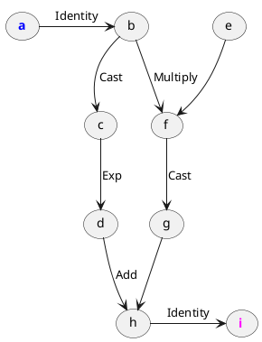

# Check
> `"bits_of_matcha/engine/lambda/passes/check.h"`\
> `engine::check(const Lambda& lambda) -> int`

Passes through the lambda, and performs automatic validity checks. 

!> Keep in mind that some issues, such as dangling pointers
   to prematurely freed tensors and operations, can not be found by `check`.
   Still, using `check` is a good debug practice when e.g.
   developing custom [`Pass`](engine/lambda/passes/) functions.

|Return value|Interpretation|
|------------|--------------|
| `0`        | No invalidity found. This is what you usually want.|
| `1`        | The lambda's `ops` are not topologically sorted. |
| `2`        | The lambda's `ops` are not unique. |
| `3`        | Some tensors accessible from the lambda are not included in its `tensors`. |
| `4`        | The lambda's `tensors` are not unique. |

## Example

Consider the following function:

```cpp
tensor foo(tensor a) {
  return 3 * a + exp(a);
}
```

Tracing it produces the following lambda:

```txt
lambda(a: Int[]) -> Float[] {
    b = Identity(a)
    c = Cast(b)
    d = Exp(c)
    f = Multiply(e, b)
    g = Cast(f)
    h = Add(g, d)
    i = Identity(h)

    return i
}
```



First, let's check that this lambda is valid.
Indeed, the following code prints `0`:

```cpp
std::cout << check(lambda) << std::endl;
```

Now, suppose we create a custom pass. It will reverse the order of `ops`.
That is of course problematic:

```cpp
void reverse(Lambda& lambda) {
  std::reverse(lambda.ops.begin() lambda.ops.end());
}
```

After running the custom pass, `check` returns `1`, meaning `ops` are not
topologically sorted.


## Op implementation requirements

Check does not query operations on any
[`Reflection`](engine/op/reflection) property.
