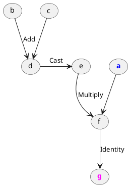
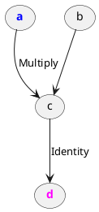

# Constant propagation
> `"bits_of_matcha/engine/lambda/passes/constantPropagation.h"`\
> `engine::constantPropagation(Lambda&) -> void`

Passes through the lambda, runs all _deterministic_ non-_side-effect_
operations depending on constant tensors only, and prunes them.
For example, this means that arithmetic functions (`Add`, `Matmul`, ...)
can be propagated through. On the other hand, `SideOutput` can not,
since it has a side effect. Similarly non-deterministic operations,
such as various random number generators (`Uniform`, `Normal`, ...)
are also never pre-computed. This is decided based on the operations'
[`Reflection`](engine/op/reflection), 
see [op implementation requirements](#op-implementation-requirements).

!> Constant propagation may also decrease memory usage. However,
   note that it may also increase it by pre-computing large tensors
   that depend on small ones.

## Example

Consider the following function:

```cpp
tensor foo(const tensor& x) {
  tensor temp = 3;
  temp += 4;
  return x * temp;
}
```

Lambda **before the pass**:

```txt
lambda(a: Float[3, 3]) -> Float[3, 3] {
    d = Add(b, c)
    e = Cast(d)
    f = Multiply(a, e)
    g = Identity(f)

    return g
}
```



Here, `d` is the result of `3 + 4`, which is then casted to Float `e`,
in order to be multiplied with Float input. The addition and cast can
be pre-computed, since they are both deterministic,
have no side-effect, and transitively depend only on constant tensors.

Lambda **after the pass**:

```txt
lambda(a: Float[3, 3]) -> Float[3, 3] {
    c = Multiply(a, b)
    d = Identity(c)

    return d
}
```



The addition and cast has been pre-computed.

## Op implementation requirements

Constant propagation queries operations on the following 
[`Reflection`](engine/op/reflection) properties:

- `bool side_effect`
- `bool deterministic`

