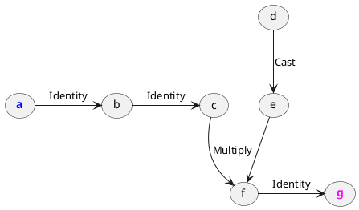

# Copy propagation
> `"bits_of_matcha/engine/lambda/passes/copyPropagation.h"`\
> `engine::copyPropagation(Lambda&) -> void`

Passes through the lambda and contracts all identity operations.

## Example

Consider the following function:

```cpp
tensor foo(tensor x) {
  tensor temp = x;
  temp *= 2;
  return temp;
}
```

Lambda **before the pass**. 
```txt
lambda(a: Float[3, 3]) -> Float[3, 3] {
    b = Identity(a)
    c = Identity(b)
    e = Cast(d)
    f = Multiply(c, e)
    g = Identity(f)

    return g
}
```



!> Note that the first identity is created
   implicitly due to the input tensor being passed by value
   rather than by reference:

Lambda **after the pass**:

```txt
lambda(a: Float[3, 3]) -> Float[3, 3] {
    c = Cast(b)
    d = Multiply(a, c)

    return d
}
```

```plantuml
(<color:blue>**a**) -> (c) : Cast
(c) --> (<color:magenta>**d**) : Multiply
(a) --> (<color:magenta>**d**)
```

All identities have been eliminated.

## Op implementation requirements

Copy propagation does not query operations on any
[`Reflection`](engine/op/reflection) property.
