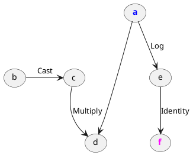
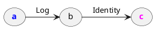

# Dead code elimination
> `"bits_of_matcha/engine/lambda/passes/deadCodeElimination.h"`\
> `engine::deadCodeElimination(Lambda&) -> void`

Passes through the lambda, and prunes all tensors and operations that 
no lambda output or side effect depends on.

## Example

Suppose the following function:

```cpp
tensor foo(const tensor& x) {
  tensor useless = 2 * x;
  return log(x);
}
```

Lambda **before the pass**:

```txt
lambda(a: Float[3, 3]) -> Float[3, 3] {
    c = Cast(b)
    d = Multiply(c, a)
    e = Log(a)
    f = Identity(e)

    return f
}
```



As you can see, the multiplication is performed even though it has no actual
effect on the output.

Lambda **after the pass**:

```txt
lambda(a: Float[3, 3]) -> Float[3, 3] {
    b = Log(a)
    c = Identity(b)

    return c
}
```



The multiplication and the cast have been pruned.

## Op implementation requirements

Dead code elimination does not query operations on any
[`Reflection`](engine/op/reflection) property.
