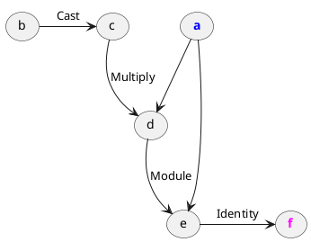
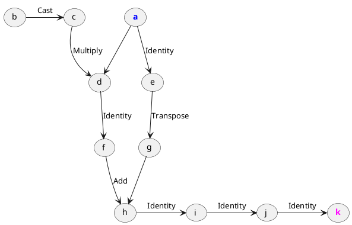
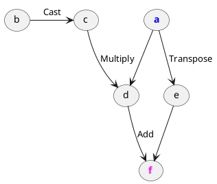

# Inline expansion
> `"bits_of_matcha/engine/lambda/passes/inlineExpansion.h"`\
> `engine::inlineExpansion(Lambda&) -> void`

Finds nested lambdas and recursively inlines them into the outer lambda.

?> This is usually done before other passes 
   to allow further intraprocedural optimizations.

## Example

Suppose the following functions. We will be interested in JITed `foo`, 
that is `joo`:

```cpp
tensor bar(const tensor& a, const tensor& b) {
  return a.t() + b;
}

auto jar = jit(bar);

tensor foo(const tensor& x) {
  return jar(x, x * 3);
}

auto joo = jit(foo);
```

Joo lambda **before the pass**:

```txt
lambda(a: Float[3, 3]) -> Float[3, 3] {
    c = Cast(b)
    d = Multiply(a, c)
    e = Module(a, d)
    f = Identity(e)

    return f
}
```



The lambda internally calls a "black box" `Module` operations,
which contains the compiled `bar`/`jar` logic.

Joo lambda **after the pass**:

```txt
lambda(a: Float[3, 3]) -> Float[3, 3] {
    c = Cast(b)
    d = Multiply(a, c)
    e = Identity(a)
    f = Identity(d)
    g = Transpose(e)
    h = Add(g, f)
    i = Identity(h)
    j = Identity(i)
    k = Identity(j)

    return k
}
```



The inner `bar`/`jar` module has been inlined into the outer `foo`/`joo` 
lambda using Identity functions. 

We can **simplify this further** by additionally running 
[`engine::copyPropagation`](engine/lambda/passes/copy-propagation):

```txt
lambda(a: Float[3, 3]) -> Float[3, 3] {
    c = Cast(b)
    d = Multiply(a, c)
    e = Transpose(a)
    f = Add(e, d)

    return f
}
```



## Op implementation requirements

All operations in the nested lambdas are expected to be 
[copy-constructible](https://en.cppreference.com/w/cpp/language/copy_constructor). \
Inline expansion does not query operations on any
[`Reflection`](engine/op/reflection) property.

