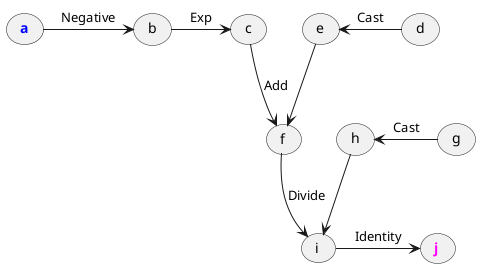

# Tracing

> `"bits_of_matcha/engine/lambda/Tracer.h"`\
> `engine::trace(const fn& function, const std::vector<Frame>& frames) -> Lambda`

Tracing is a technique for inspecting what happens within some block of code.
The Matcha Tracing system is able to trace tensor operations in user-defined
functions in the program runtime. 
The result of a tracing process is a valid [`engine::Lambda`](engine/lambda/). For details 
and limitations, refer to [this article](tensor/tracing).

## Example

Consider the following function:

```cpp
tensor sigmoid(tensor x) {
  return 1 / (1 + exp(-x));
}
```

To trace it, call `engine::trace` on the function, specifying the
input [`Frame`](tensor/frames) vector.

```cpp
// Trace the function for specified frames
std::vector frames = { Frame(Float, {5, 5}) };
Lambda lambda = trace(sigmoid, frames);

// Let's see the lambda
std::cout << lambda << std::endl;

// The lambda should be valid
std::cout << "The lambda is "
          << (check(lambda) == 0 ? "valid!" : "invalid!") << std::endl;
```

Voilà:

```txt
lambda(a: Float[3, 3]) -> Float[3, 3] {
    b = Negative(a)
    c = Exp(b)
    e = Cast(d)
    f = Add(e, c)
    h = Cast(g)
    i = Divide(h, f)
    j = Identity(i)

    return j
}
The lambda is valid!
```




## Tracer
> `"bits_of_matcha/engine/lambda/Tracer.h"`\
> `engine::Tracer`

Class faciliating potentially recursive tracing.

#### Control methods

- `open(const std::vector<Frame>& frames) -> std::vector<tensor>` - initializes the tracing process and returns inputs
- `close(const std::vector<tensor>& outputs) -> Lambda` - finalizes the tracing process and returns the resulting lambda

#### Tracer lifecycle

- a `Tracer` is instantiated
- its `open(const std::vector<Frame>& frames)` method is called, returning
  traced input tensors
- tensors and dispatched operations are handed to the Tracer, instead of being run and cleaned up as usual
- the tracer's `close(const std::vector<tensor>& outputs)` method is called
  on the output tensors, finalizes the tracing process and returns the resulting `Lambda`
- the tracer is destroyed
