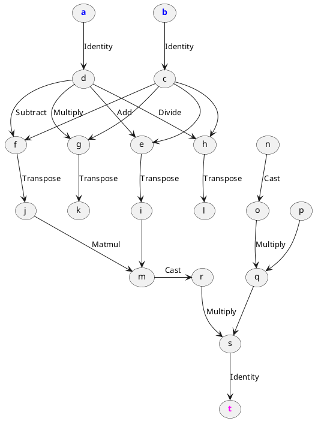
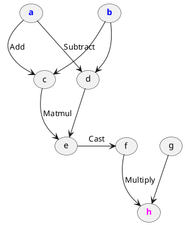

# JIT compilation
> `jit(const fn& function) -> fn`

JIT is an easy-to-use tool for transforming dynamic programs into static ones.
It takes a native function (or lambda) that only accepts and returns tensors,
and gives back a reusable optimized version of that same function.

Roughly, this can be thought of as the difference
between writing a dynamic [PyTorch](https://pytorch.org/) code and 
building a static [TensorFlow](https://www.tensorflow.org/) graph.
Both have advantages and disadvantages. Dynamic code is easier to debug
and allows greater flexibility. Static graphs, on the other hand, are
completely language-agnostic and therefore very portable, and often allow
non-trivial optimizations for performance and memory. Matcha is designed
in a way that enables both frameworks and lets you decide which is better
for specific applications.

!> This article is about the usage, pros, and cons of JIT. \
   For internal function representation and manipulation, refer to the
   [`engine::Lambda`](engine/lambda/) section. \
   For wrapping native C++ function in that manner, read [`engine::Transform`](engine/transform/),


## Usage

Consider the following function operating only on tensors:

```cpp
tensor foo(tensor a, tensor b) {
  tensor c = tanh(a);
  tensor d = matmul(a.t(), b);
  return exp(d - max(d));
}
```

To JIT it, simply call call `jit` on it. The higher-order function
`jit` returns the JITed version of the given tensor function. 
Next, we can use it simply as a usual function:

```cpp
int main() {
  // JIT foo
  auto joo = jit(foo);

  // prepare inputs
  tensor a = ones(50, 2);
  tensor b = uniform(50, 50);

  // we can now use `joo` instead of `foo`
  tensor c = joo(a, b);

  // voila
  std::cout << c << std::endl;
}
```

Output:

```txt
[[0.0115125   0.056408    0.0413443   ...  0.00737378  0.00350635  0.00479942  0.00427523 ]
 [0.0115125   0.056408    0.0413443   ...  0.00737378  0.00350635  0.00479942  0.00427523 ]]
```

Note that JITing imposes several [limitations](tensor/jit-limitations).
JITing blindly may result in undesired behavior.

## Optimizations

Currently, JIT performs the following optimizations (in the respective order).
For general implementation details, 
refer to [`engine::Pass`](engine/lambda/passes/). \
Every optimizatons is also documented individually:

- [Inline expansion](engine/lambda/passes/inline-expansion) - 
  recursively inlines all nested functions to allow
  for further interprocedural optimizations.
- [Dead code elimination](engine/lambda/passes/dead-code-elimination) - 
  transitively prunes operations that no direct effect or
  side effect depends on. This can speed up the rest of the process.
- [Matmul fusion](engine/lambda/passes/matmul-fusion) - 
  fuses matrix multiplications with adjacent transpose operations. \
  This results in iterating through the matrices in a transposed manner
  rather than creating unnecessary transposed copies. \
  Both normal transpose and the Hermitian transpose are supported.
- [Copy propagation](engine/lambda/passes/copy-propagation) -
  transitively eliminates tensor copies.
- [Constant propagation](engine/lambda/passes/constant-propagation) - 
  transitively pre-caches tensors that can be computed
  in the compile-time instead of the run-time. \
  Note that this can also affect memory usage.

## Limitations

As mentioned above, not every code can, or should, be JITed. Matcha makes
use of the [tracing](tensor/tracing) technique to inspect JITed functions.
This imposes several [limitations](tensor/jit-limitations) on the JITed
code. For details and examples of this, see:

- [Forbidden acces to tensor cata](tensor/jit-limitations#forbidden-access-to-tensor-data) 
  via [`tensor::data()`](tensor/accessing-data)
- [Inhibited IO side effects](tensor/jit-limitations#inhibited-io-side-effects) -
  IO side effects are inhibited in JITed functions
- [Static flow control](tensor/jit-limitations#static-flow-control) -
  Dynamic native flow control is cached when tracing and is completely
  static in subsequent function runtime
- [Caching native variables](tensor/jit-limitations#caching-native-variables)
  Invariance on mutable non-[`tensor`](tensor/) variables during the function runtime

## To JIT or not to JIT

**JIT** when:

- The function contains **many operations** operating on **big data**.
- The **overhead for operation initialization** is too large.
- The function has only **[`tensor`](tensor) external parameters** needed in runtime.

**Don't JIT** when:

- The function is not **performance-critical**.
- You want to **control the function flow**.
- You want to directly **access tensor buffers**.

## Example

Suppose the following function:

```cpp
tensor foo(tensor a, tensor b) {
  using namespace std::complex_literals;

  tensor pl = a + b;
  tensor mi = a - b;
  tensor mu = a * b;
  tensor di = a / b;

  pl = pl.t();
  mi = mi.t();
  mu = mu.t();
  di = di.t();

  tensor c = matmul(pl, mi);

  tensor d = 2.71828;
  d *= -1i;

  return c * d;
}
```

JIT it:

```cpp
auto joo = jit(foo);
```

Building it for `Float[3, 3]` inputs produces **the following lambda**:

```txt
lambda(a: Float[3, 3], b: Float[3, 3]) -> Cfloat[3, 3] {
    c = Identity(b)
    d = Identity(a)
    e = Add(d, c)
    f = Subtract(d, c)
    g = Multiply(d, c)
    h = Divide(d, c)
    i = Transpose(e)
    j = Transpose(f)
    k = Transpose(g)
    l = Transpose(h)
    m = Matmul(i, j)
    o = Cast(n)
    q = Multiply(o, p)
    r = Cast(m)
    s = Multiply(r, q)
    t = Identity(s)

    return t
}
```

Lambda flow can be represented as a directed acyclic multigraph. In this case,
it will look like this:



After passing through the lambda with the various optimizers,
it is **simplified into the following**:

```txt
lambda(a: Float[3, 3], b: Float[3, 3]) -> Cfloat[3, 3] {
    c = Add(a, b)
    d = Subtract(a, b)
    e = Matmul(c, d)
    f = Cast(e)
    h = Multiply(f, g)

    return h
}
```

Visualized as following:



Voilà, from 16 operations down to 5. That is **reduction by 69%**.

Still, both `foo` and `joo` should give the same output.
Let us try it:

```cpp
int main() {
  // Prepare the inputs
  tensor a = normal(3, 3); 
  tensor b = normal(3, 3);

  // Show the results
  std::cout << "foo:\n" << foo(a, b) << "\n\n"
            << "joo:\n" << joo(a, b) << std::endl;
}
```

Output:

```txt
foo:
[[0-18.5888i  0+23.8254i  0-8.41299i ]
 [0+8.33552i  0-0.151072i 0+1.56344i ]
 [0-14.3005i  0+21.7137i  0+2.17825i ]]

joo:
[[0-18.5888i  0+23.8254i  0-8.41299i ]
 [0+8.33552i  0-0.151072i 0+1.56344i ]
 [0-14.3005i  0+21.7137i  0+2.17825i ]]
```
