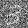

# Utilities

Miscellanous, handy operations out-of-the-box. Note that all of them can be used inside the [Flow](flow/), including side-effects.

## Printing

Most matcha objects implement some type of default printing. This is extremely handy for debugging. 

```cpp
tensor x = ones(2, 3);

std::cout << x.frame() << "\n\n";
std::cout << x << "\n";

```

Output:

```txt
Float[2, 3]

[[1 1 1]
 [1 1 1]]
```


Printing inside the [Flow](flow/) is supported. However, [liquified](flow/) printing only works with the `std::cout`.

```cpp
auto foo = (Flow) [] (tensor x) {
  std::cout << "input: " << x << std::endl;
  tensor y = 2 * x;
  std::cout << "output: " << y << std::endl;
  return y;
}

foo(3);
```

Output:

```txt
input: 3
output: 6
```


## image

> `image(const tensor& a, const std::string& file)`

Renders tensor image. The image dimensions are given by the last two (matrix-wise) axes of input tensor.

!> Currently, the only supported target format is `.png`.

In the following example, we will render tensors loaded from the hand-written digit dataset [MNIST](https://en.wikipedia.org/wiki/MNIST_database).
As a demonstration, we will add more and more noise to the digits. For details about matcha dataset pipelines, read the [Dataset](dataset/) article series.


```cpp
int main() {
  Dataset ds = dataset::Csv {"mnist_train.csv"};

  float noise = 0;
  for (Instance i: ds.take(10)) {
    tensor digit = i["x"].reshape(28, 28) / 255;
    digit += noise * normal(digit.shape());
    std::string file = "out/" + std::to_string(noise) + ".png";
    image(digit, file);
    noise += .1;
  }
}
```





